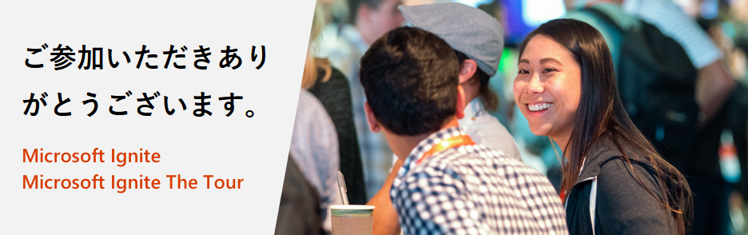

# Microsoft Ignite and Microsoft Ignite The Tour: 無料の認定試験のオファー

<em><strong>2020 年 3 月 26 日更新:</strong> コロナウイルス (COVID-19) に対応して、Microsoft は試験の特典を 2021 年 1 月 31 日まで延長しています。つまり、このようなイベントによる認定試験の特典は、当初 180 日間有効でしたが、現在は 2021 年 1 月 31 日まで有効になっています。<a href="https://aka.ms/covid-19certannoucement">"詳細について学びます</a>。この変更は、以下のように細部にわたって反映されます。</em>

Microsoft Ignite 2019またはMicrosoft Ignite The Tour 2019-2020にご参加いただき、ありがとうございます。ご本人がイベント参加されたみなさまは、[利用規約](#terms-and-conditions) に従い、スキルアップを継続して、経営者または同僚に対して技術的専門知識を証明するための認定試験を無料で受けることができるようになります。

## オファーの詳細

Microsoft Ignite 2019 または Microsoft Ignite The Tour 2019-2020 イベントに参加された方は、Microsoft の基礎、ロールベース、または専門の認定試験のうちの 1 つを無料で受験する資格が得られます。無料試験の特典は、現在参加されているイベントの始めから利用可能であり、2021 年 1 月 31 日まで有効です。その期間内に試験を受ける予定または資格がない場合は、この特典は利用できません。  

##  無料試験の申込み方法

以下、無料試験の申し込み方法について順を追って説明します。

**ステップ 1:** いずれかの [資格試験](#eligible-exams-for-this-offer) を選択し、「試験のスケジュール」ボタンをクリックしてオンライン登録プロセスを開始します。  

**ステップ 2:** 現在の Microsoft 認定資格プロフィールにサインインするか、Microsoft アカウントを使用して作成します。  

**ステップ 3:** ログインしたら、自身の認定プロフィールの詳細が正確であることを確認します。  

**ステップ 4:** 認定プロフィール ページの下部にある「保存して続けるボタン」をクリックして、「試験割引き」ページに移ります。  
![認定資格プロフィール ページの下部にある [保存して続行] ボタンをクリック](images/step-4-2x.png)

**ステップ 5:** 「試験割引」ページでは、イベントの登録に使用したメール アドレスを入力します (例：alias@company.com や alias@outlook.com)。  

**ステップ 6:** 試験割引の対象者である場合は、入力したアドレスに確認メールが届きます。次へ進むには、メールに記載されているパスコードを入力する必要があります。メールが届かない場合は、コードを再送してください。  

**ステップ 7:** 正しいパスコードを入力すると、アカウントをリンクするように求められます。割引を受けるためには、アカウントをリンクすることに同意する必要があります。  

次回ログインしたときに、いずれかのアカウントの試験割引の資格がある場合は、割引が自動的に表示されます。アカウントを削除するには、[Certification Dashboard](https://aka.ms/certdashboard) にアクセスし、「認定プロファイルを編集する」をクリックします。

**ステップ 8:** 上部に割引のポップアップが表示されます。請求したい割引を選択し、[この試験の受験予約をする] ボタンをクリックしてチェックアウトに進みます。  

**ステップ 9:** 次の画面のステップに従い、試験を予定するために必要な詳細を提供します。チェックアウト中に、総支払金額が 0.00 ドルであることを確認し、注文を提出します。  

**認定サポート:**

試験を予定する問題については、[Microsoft 認定資格サポート フォーラム](https://trainingsupport.microsoft.com/mcp/forum?sort=LastReplyDate&dir=Desc&tab=All&status=all&mod=&modAge=&advFil=&postedAfter=&postedBefore=&threadType=All&isFilterExpanded=false&page=1) のヘルプを参照してください。フォーラムのモデレーターが 1 営業日以内に返信します。

##  このオファーの資格試験

このオファーには、Microsoft fundamentals、ロールベースおよび専門認定の試験が含まれます。資格試験は以下のリストの通りです。

| 製品 | 試験 |
| --- | --- |
| Azure | [AI-100: Designing and Implementing an Azure AI Solution](/learn/certifications/exams/ai-100) [AI-900: Microsoft Azure AI Fundamentals](/learn/certifications/exams/ai-900) [AZ-103: Microsoft Azure Administrator](/learn/certifications/exams/az-103) [AZ-104: Microsoft Azure Administrator (new version)](/learn/certifications/exams/az-104) [AZ-120: Planning and Administering Microsoft Azure for SAP Workloads](/learn/certifications/exams/az-120) [AZ-203: Developing Solutions for Microsoft Azure](/learn/certifications/exams/az-203) [AZ-204: Developing Solutions for Microsoft Azure (新バージョン)](/learn/certifications/exams/az-204) [AZ-220: Microsoft Azure IoT Developer](/learn/certifications/exams/az-220) [AZ-300: Microsoft Azure Architect Technologies](/learn/certifications/exams/az-300) [AZ-301: Microsoft Azure Architect Design](/learn/certifications/exams/az-301) [AZ-303: Microsoft Azure Architect Technologies](/learn/certifications/exams/az-303) [AZ-304: Microsoft Azure Architect Design](/learn/certifications/exams/az-304) [AZ-400: Designing and Implementing Microsoft DevOps Solutions](/learn/certifications/exams/az-400) [AZ-500: Microsoft Azure Security Technologies](/learn/certifications/exams/az-500) [AZ-900: Microsoft Azure Fundamentals](/learn/certifications/exams/az-900) [DA-100: Analyzing Data with Microsoft Power BI](/learn/certifications/exams/da-100) [DP-100: Designing and Implementing a Data Science Solution on Azure](/learn/certifications/exams/dp-100) [DP-200: Implementing an Azure Data Solution](/learn/certifications/exams/dp-200) [DP-201: Designing an Azure Data Solution](/learn/certifications/exams/dp-201) [DP-300: Administering Relational Databases on Microsoft Azure](/learn/certifications/exams/dp-300) [DP-900: Microsoft Azure Data Fundamentals](/learn/certifications/exams/dp-900) |
| Dynamics 365 and Power Platform | [MB-200: Microsoft Power Platform + Dynamics 365 Core](/learn/certifications/exams/mb-200) [MB-210: Microsoft Dynamics 365 Sales](/learn/certifications/exams/mb-210) [MB-220: Microsoft Dynamics 365 Marketing](/learn/certifications/exams/mb-220) [MB-230: Microsoft Dynamics 365 Customer Service](/learn/certifications/exams/mb-230) [MB-240: Microsoft Dynamics 365 Field Service](/learn/certifications/exams/mb-240) [MB-300: Microsoft Dynamics 365: Core Finance and Operations](/learn/certifications/exams/mb-300) [MB-310: Microsoft Dynamics 365 Finance](/learn/certifications/exams/mb-310) [MB-320: Microsoft Dynamics 365 Supply Chain Management, Manufacturing](/learn/certifications/exams/mb-320) [MB-330: Microsoft Dynamics 365 Supply Chain Management](/learn/certifications/exams/mb-330) [MB-400: Microsoft Power Apps + Dynamics 365 Developer](/learn/certifications/exams/mb-400) [MB-500: Microsoft Dynamics 365: Finance and Operations Apps Developer](/learn/certifications/exams/mb-500) [MB-600: Microsoft Dynamics 365 + Power Platform Solution Architect](/learn/certifications/exams/mb-600) [MB-700: Microsoft Dynamics 365: Finance and Operations Apps Solution Architect](/learn/certifications/exams/mb-700) [MB-901: Microsoft Dynamics 365 Fundamentals](/learn/certifications/exams/mb-901) [PL-100: Microsoft Power Platform App Maker](/learn/certifications/exams/pl-100) [PL-900: Microsoft Power Platform Fundamentals](/learn/certifications/exams/pl-900) |
| Microsoft 365 | [MD-100: Windows 10](/learn/certifications/exams/md-100) [MD-101: Managing Modern Desktops](/learn/certifications/exams/md-101) [MS-100: Microsoft 365 Identity and Services](/learn/certifications/exams/ms-100) [MS-101: Microsoft 365 Mobility and Security](/learn/certifications/exams/ms-101) [MS-200: Planning and Configuring a Messaging Platform](/learn/certifications/exams/ms-200) [MS-201: Implementing a Hybrid and Secure Messaging Platform](/learn/certifications/exams/ms-201) [MS-203: Microsoft 365 Messaging](/learn/certifications/exams/ms-203) [MS-300: Deploying Microsoft 365 Teamwork](/learn/certifications/exams/ms-300) [MS-301: Deploying SharePoint Server Hybrid](/learn/certifications/exams/ms-301) [MS-500: Microsoft 365 Security Administration](/learn/certifications/exams/ms-500) [MS-600: Building Applications and Solutions with Microsoft 365 Core Services](/learn/certifications/exams/ms-600) [MS-700: Managing Microsoft Teams](/learn/certifications/exams/ms-700) [MS-900: Microsoft 365 Fundamentals](/learn/certifications/exams/ms-900) |

## よくあるご質問

### オファーについて

**質問: このオファーで無料で受験できる試験はいくつありますか？**

**回答:** このオファーでは、 1 つの無料資格認定試験を受けることができます。このオファーでは、複数の Microsoft Ignite イベントに出席される場合でも、無料となるのは 1件の資格のある試験です。

**質問: このオファーは、何の資格の認定試験ですか ？**

**回答:** このオファーには、Microsoft fundamentals、ロールベースおよび専門認定の試験が含まれます。資格認定試験のリストについては、当社のオファー詳細ページの「このオファーの資格試験」セクションを参照してください。[https://docs.microsoft.com/learn/certifications/microsoft-ignite-free-certification-exam-offer#eligible-exams-for-this-offer](https://docs.microsoft.com/learn/certifications/microsoft-ignite-free-certification-exam-offer#eligible-exams-for-this-offer).

**質問: 資格イベントに登録したけれど直接参加しなかった場合でも、このオファーを請求できますか？**

**回答:** いいえ、このオファーは、Microsoft Ignite 2019またはMicrosoft Ignite The Tour 2019-2020イベントに参加した有資格の個人のみが申し込みできます。

**質問: 有資格者となれるイベントに登録しても、イベントがキャンセルされた場合、このオファーを請求することはできますか？**

**回答:** できません。この認定試験オファーはイベント会場での体験の延長であり、イベントがキャンセルされた場合は、認定試験オファーはご利用になれません。ですが、[Microsoft Learn](https://docs.microsoft.com/learn/) での無料の対話型トレーニングで学習を継続されることをお勧めします。

**質問: このオファーの契約条件で、イスラエル、ドイツ、またはスウェーデンの居住者は利用できないと規定しているのはなぜですか？**

**回答:** これらの地域の居住者は、 Microsoft のギフト ポリシーおよび現地の法律により、このオファーを受ける資格がありません。これらの国々にはそれぞれ、居住者への贈り物を制限する特定の法律があり、認定試験の価値は制限を超えているため、Microsoft はこれらの国の居住者に無料の試験を提供することができないのです。

### 無料試験のスケジューリング

**質問: 私が参加した、あるいは参加予定のイベント中に、このオファーからの無料試験をスケジュールする必要がありますか？**

**回答:** いいえ。参加したイベント中は、このオファーの無料試験をスケジュールする必要はありません。イベント中またはイベント後に試験をスケジュールできます。無料試験を受験する特典は、2021 年 1 月 31 日に無効になります。

**質問: 2021 年 1 月 31 日までに試験を受ける必要がありますか？**

**回答:** はい。 2021 年 1 月 31 日以前に試験を受ける必要があります。

**質問: このオファーから無料受験をスケジュールする方法を教えてください。**

**回答:** 無料試験のスケジュール方法については、 こちらへ進みます。[https://docs.microsoft.com/learn/certifications/microsoft-ignite-free-certification-exam-offer#how-to-claim-your-free-exam](https://docs.microsoft.com/learn/certifications/microsoft-ignite-free-certification-exam-offer#how-to-claim-your-free-exam).

**質問: 試験の割引資格を確認する際に、私は国家公務員ではあるが、そうではないために、私は無資格と記載しようとしたら、エラーが発生しました。どうすればいいですか？**

**回答:** 誤って国家公務員として特定された場合は、イベント登録プロフィールで政府機関フィールドを更新し、資格を確認するためには、イベントが終了するまで待つ必要があります。また、サポートを受けるためには以下までお問い合わせください。 [Microsoft 認定サポートフォーラム](https://trainingsupport.microsoft.com/mcp/forum?sort=LastReplyDate&dir=Desc&tab=All&status=all&mod=&modAge=&advFil=&postedAfter=&postedBefore=&threadType=All&isFilterExpanded=false&page=1) ([https://aka.ms/CertificationSupport](https://aka.ms/CertificationSupport)).

**質問: 無料試験のスケジューリングがうまくできません。サポートはどこで受けられますか？**

**回答:** [Microsoft 認定サポートフォーラム](https://trainingsupport.microsoft.com/mcp/forum?sort=LastReplyDate&dir=Desc&tab=All&status=all&mod=&modAge=&advFil=&postedAfter=&postedBefore=&threadType=All&isFilterExpanded=false&page=1) よりサポートを受けられます ([https://aka.ms/CertificationSupport](https://aka.ms/CertificationSupport)).モデレーターが 1 営業日以内に返信します。

**質問: 予定されている試験を直接受けるか、オンラインで受けるかを選択できますか?**

**回答:** はい。現地のテストセンターでPearson Vue の定期試験を直接受けるか、 またはオンラインプロクター(OP)経由で定期試験を受けることができます。オンライン試験の詳細については、こちらへ進んでください。
[https://docs.microsoft.com/learn/certifications/online-exams](/learn/certifications/online-exams)

### キャンセルおよび再スケジュールポリシー

**質問: 必要な場合、このオファーから試験予約を再スケジュールできますか？**

**回答:** はい。試験の予約は再スケジュールできますが、有効期限までに再スケジュールする必要があります。詳細については、[スケジュール変更ポリシーを参照](/learn/certifications/certification-exam-policies#cancellation-and-reschedule-policy)_してください。

**質問: 試験の予約を再スケジュールまたはキャンセルするときに料金はかかりますか ？**

**回答:** 試験予約日から 6 営業日以上前に試験の予約を再スケジュールした場合やキャンセルした場合、料金は発生しません。試験時間の 5 営業日前以内にスケジュールを変更する必要がある場合は、再スケジュール手数料をお支払いいただく必要があります。予定されている試験時間の 2 日以内になっている場合は、試験を再スケジュールしたりキャンセルしたりすることはできません。試験に参加できない場合は、このオファーの無料受験資格を失うことになります。詳細は、[キャンセルおよび再スケジュールのポリシー](/learn/certifications/certification-exam-policies#cancellation-and-reschedule-policy) をご覧ください。

**質問: 試験の予約を逃し、再スケジュールやキャンセルをしなかった場合はどうなりますか？**

**回答:** 予定されていた試験時間に現れなかった場合や、試験時間より 24 時間以内に再スケジュールまたはキャンセルしなかった場合、無料試験オファーの権利が失われます。詳細は、[キャンセルおよび再スケジュールのポリシー](/learn/certifications/certification-exam-policies#cancellation-and-reschedule-policy) をご覧ください。

### 再受験ポリシー

**質問: 無料の認定試験を最初に受験できなかった場合、無料で再受験できますか？**

**回答:** いいえ。このオファーは 1 回のみ有効で、再試験は別々にスケジュールする必要があります。認定試験の再受験の詳細については、 [再受験ポリシー](/learn/certifications/certification-exam-policies#security-policies) を参照してください。

##  契約条件

- この試験特典は、Microsoft Ignite 2019 または Microsoft Ignite The Tour 2019-2020 イベントに参加した有資格の個人が利用できます。
- この試験オファーは1つの Microsoft 認定試験を受けるために復活されるもので、公認のピアソン VUE 試験センターで実施されるか、あるいはピアソン VUE のオンライン プロトコル サイトによって実施されます。
- この試験オファー、試験固有のもので、選択したMicrosoft の試験にのみ復活可能です。
- この試験特典は、試験特典を受け取ったイベントの初日から利用可能であり、2021年 1 月 31 日に終了します。
- この試験特典は、有効期限日までに 1 回の試験を登録して受験する権利を与えるものです。
- この試験オファーの有効期間は、いかなる条件でも延長することができません。
- この試験オファーは、以下のどちらかでも有効または復活できません：1) 政府官僚、あるいは 2) イスラエル、ドイツ、またはスウェーデンの在住者。  * このオファーは国家公務員、あるいはMicrosoft ・ポリシーおよび現地法に基づき許容の限度を超えている **ような** 居住者は利用できません。
- この試験オファーは、一度だけ回復される場合があります。 
- この試験オファーは、キャッシュ、クレジットあるいは返金と回復または交換されない場合があります。
- この試験オファーは、譲渡不可であり、任意の方法で変更、改訂、または譲渡した場合は無効となります。

追加情報については、完全版 [Microsoftの利用規約](https://www.microsoft.com/en-us/legal/intellectualproperty/copyright/default.aspx?SilentAuth=1) をご参照ください。
